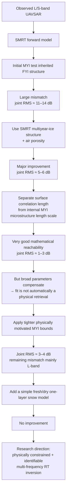
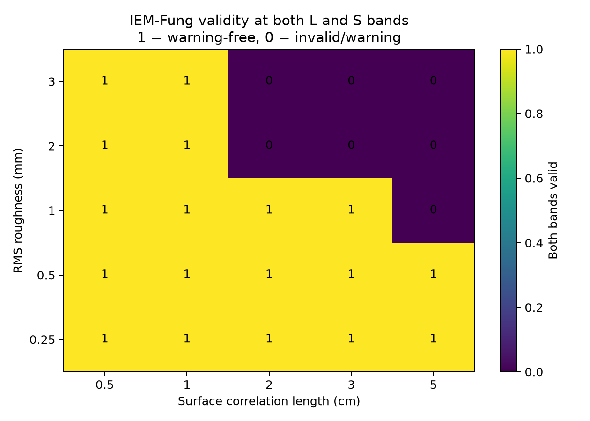
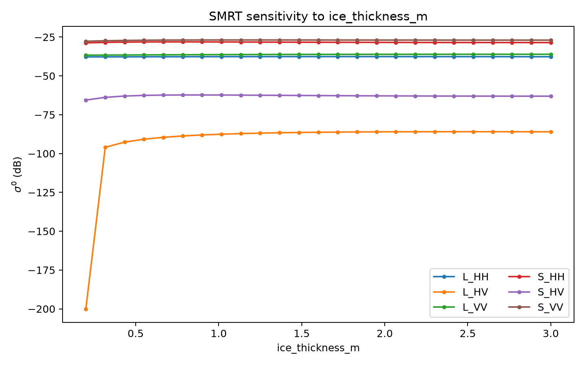
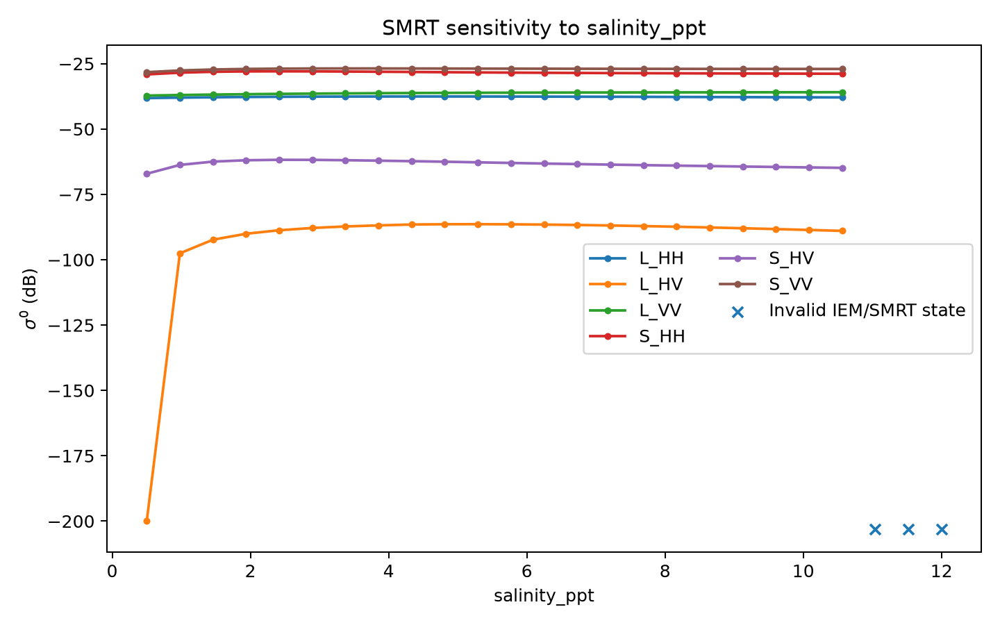
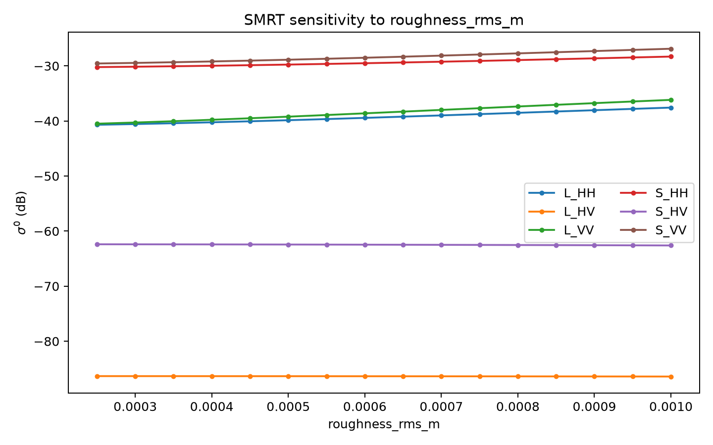
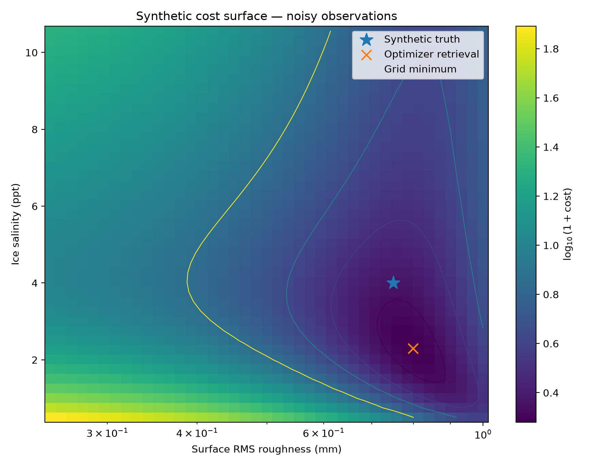

# Sea-ice radiative-transfer identifiability with L/S-band SAR

**Preliminary SMRT study of forward-model adequacy, parameter identifiability, and the feasibility of a later physics-constrained inverse model for sea ice.**

> **Status:** pilot / feasibility study. This repository does **not** claim a validated physical retrieval or a completed real-data PINN.

---

## At a glance



### Main numerical progression

| Stage | What changed? | Joint L+S RMS |
|---|---|---:|
| Incidence-aware MYI test with FYI structure | Baseline structural mismatch | **≈ 11–14 dB** |
| Correct MYI structure | Multiyear ice + porosity | **≈ 5–6 dB** |
| Separate surface and internal length scales | More physically distinct model freedom | **≈ 1–3 dB** |
| Tighter MYI physical bounds | Reduced parameter compensation | **≈ 3–4 dB** |
| Simple dry snow layer | One-layer fresh/dry snow added | **No improvement** |

The central result is therefore not simply *“SMRT fits”* or *“SMRT fails”*. The result is that **forward-model structure and parameter constraints strongly control reachability, and an excellent SAR fit can still be physically non-unique.**

---

## Why this project starts with the forward problem

The eventual goal is an inverse problem:

\[
\text{SAR observations } y \rightarrow \text{estimated physical state } \hat m.
\]

A future physics-constrained neural network could learn an inverse map

\[
f_\theta(y)\rightarrow \hat m,
\]

while the radiative-transfer model checks whether

\[
G(\hat m)\approx y.
\]

But that inverse model is only meaningful if the forward model itself can represent the observations over a physically defensible parameter domain.

This project therefore asks, in order:

1. **Reachability / existence:** can any allowed physical state reproduce the observed SAR?
2. **Identifiability:** can different physical states produce distinguishable SAR signatures?
3. **Stability:** do weak parameter directions amplify measurement noise?
4. **Model structure:** how strongly do FYI/MYI structure, roughness, microstructure and snow assumptions affect the answer?

Only after these questions are understood should a final real-data inverse model be trusted.

---

## Forward-model configuration

The baseline experiments use:

- [SMRT](https://www.smrt-model.science/) for microwave radiative transfer;
- IBA electromagnetic model;
- DORT radiative-transfer solver;
- IEM-Fung-1992 rough-interface scattering;
- active L band at approximately **1.257 GHz**;
- active S band at approximately **3.200 GHz**;
- HH/HV/VV in the early sensitivity experiments;
- L-HH, L-VV, S-HH and S-VV for the real-data reachability sequence.

`config/base.yaml` intentionally preserves the original **first-year-ice baseline** used in experiments 00–09. Experiments 10–13 explicitly override this with SMRT's multiyear-ice structure when testing MYI observations.

---

# Experiment sequence

## 1. Check the forward model

`00_check_smrt.py` and `01_single_forward.py`

The first step was simply to verify that a reproducible active L/S-band sea-ice forward simulation could be generated:

\[
m \rightarrow G(m) \rightarrow \sigma^0.
\]

This establishes the forward-model machinery before any inversion is attempted.

---

## 2. Check IEM validity

`01b_iem_validity_grid.py`

IEM is not valid for every roughness / correlation-length combination, so the admissible model domain was mapped before optimization.



This avoids interpreting an optimizer solution that lies in a region where the rough-surface model itself is not trustworthy.

---

## 3. Parameter sensitivity

`02_parameter_sweeps.py`

Ice thickness, salinity and RMS roughness were varied separately to see how the simulated radar response changes.

<p align="center">
  
  
  
</p>

These experiments establish that different physical parameters do not influence the SAR observations equally.

---

## 4. Jacobian and SVD identifiability

`03_jacobian_svd.py`

Around a reference state,

\[
\Delta y \approx J\Delta m,
\]

where the Jacobian contains local sensitivities

\[
J_{ij}=\frac{\partial y_i}{\partial m_j}.
\]

The singular-value decomposition

\[
J=USV^T
\]

is then used to diagnose parameter combinations that are strongly visible or weakly visible to SAR.

For the initial two-parameter roughness-salinity diagnostic using all six L/S polarimetric channels, the whitened Jacobian had singular values of approximately **9.25** and **2.73**, with condition number **3.39**.

This is deliberately treated as a **local two-parameter diagnostic**, not proof that the complete sea-ice state is identifiable.

---

## 5. Sensor ablation

`04_sensor_ablation.py`

L-only, S-only and combined L+S information were compared.

In this specific two-parameter baseline, local conditioning was poorer for L-only (**15.80**) than for S-only (**2.08**).

The broader lesson is that dual-frequency observations can add complementary information, but simply adding channels does not guarantee unique recovery of all physical variables.

---

## 6. Synthetic inversion sanity check

`05_synthetic_inversion.py` and `05b_synthetic_cost_surface.py`

A known physical state was passed through the same SMRT forward model to generate synthetic observations. The inverse algorithm then attempted to recover the state.

With 1 dB channel noise, a synthetic truth of:

- roughness = **0.75 mm**
- salinity = **4.0 ppt**

produced a best retrieval of approximately:

- roughness = **0.799 mm**
- salinity = **2.29 ppt**

The observation reconstruction remained good even though the retrieved salinity moved substantially.



This is an important warning:

\[
\boxed{\text{good SAR reconstruction} \neq \text{guaranteed true physical parameters}}
\]

The synthetic test also shows that the inversion machinery itself can work when the observations genuinely come from the assumed forward model.

---

## 7. Initial real-UAVSAR reachability

`06_forward_model_existence_test.py`, `06b_expanded_bounds_existence_test.py`, and `06c_channel_subset_reachability.py`

The next question was:

\[
\min_m \|G(m)-y_{\rm UAVSAR}\|.
\]

The initial bare-ice model could not reproduce much of the observed real-data space well. Expanding parameter bounds improved the result but did not remove the discrepancy.

Channel-subset tests also showed frequency-dependent behavior, suggesting that the mismatch was not simply a single global scale error.

The committed 06/06b outputs are retained as **historical pre-mean-audit diagnostics** and should not be quantitatively compared with the later incidence-aware experiments.

---

## 8. Observation and incidence-angle audit

`07_prepare_no_incidence_normalization.py`, `08_prepare_incidence_binned_observations.py`, `09_incidence_aware_reachability.py`, and `09b_incidence_aware_safe_refinement.py`

Before adding more model physics, the SAR comparison itself was audited.

The real-data preparation was rebuilt to:

- average radar power in the **linear-power domain** before converting back to dB;
- remove the empirical normalization to 35°;
- bin observations by actual incidence angle;
- run SMRT at each bin's measured mean incidence angle.

The large MYI mismatch still remained under the FYI structural model.


A safe derivative-free refinement was also used to avoid invalid IEM trial states. It produced essentially no improvement over the coarse-grid optimum, confirming that the remaining discrepancy was not simply an optimizer failure.

---

# Key physical findings

## 9. Correcting FYI → MYI structure was decisive

`10_myi_multiyear_reachability.py`

The earlier MYI comparisons had inherited:

```yaml
ice_type: firstyear
```

from the baseline configuration.

Experiment 10 instead used SMRT's multiyear-ice representation and introduced air porosity.

The joint L+S RMS changed as follows:

| Incidence bin | FYI structure | MYI structure | Improvement |
|---|---:|---:|---:|
| 30–33° | 11.56 dB | 5.01 dB | 6.55 dB |
| 45–48° | 12.87 dB | 5.07 dB | 7.79 dB |
| 48–51° | 14.25 dB | 6.22 dB | 8.02 dB |
| 51–54° | 13.65 dB | 5.53 dB | 8.12 dB |

**Interpretation:** the physical structure of the forward model mattered much more than simple parameter tuning.

---

## 10. Separating surface and internal MYI length scales greatly improved reachability

`11_myi_length_scale_reachability.py`

Two physically different scales were allowed to vary independently:

- surface correlation length for rough-interface scattering;
- internal MYI microstructure / bubble correlation length.

The joint L+S RMS fell to approximately **1.05–2.97 dB** across the four MYI incidence bins.

However, some best-fitting states drove salinity, porosity, thickness or correlation lengths toward broad diagnostic limits.

Therefore this experiment demonstrates **mathematical reachability and model flexibility**, not validated geophysical retrieval.

---

## 11. Physically tighter MYI bounds exposed parameter compensation

`12_myi_semi_constrained_reachability.py`

Internal MYI properties were restricted to tighter ranges:

- salinity: **1–4 ppt**
- thickness: **1–3 m**
- internal correlation length: **0.2–0.8 mm**

The joint RMS increased to approximately **3.24–4.03 dB**.

At the joint solutions:

- S-band RMS remained approximately **0.76–2.66 dB**
- L-band RMS remained approximately **4.27–5.65 dB**

Several parameters again reached their allowed limits.

This is a central result:

> **A very good unconstrained SAR fit does not automatically imply that the retrieved physical state is identifiable or realistic.**

The remaining mismatch is predominantly associated with L band.

---

## 12. A simple fresh/dry snow layer did not solve the remaining discrepancy

`13_myi_one_layer_snow_test.py`

The experiment-12 ice/interface state was frozen, and only one simple snow layer was varied in:

- depth;
- density;
- snow correlation length.

The best tested snow state worsened joint L+S RMS by approximately **0.23–0.30 dB** in every retained MYI incidence bin.

No tested state improved L-band RMS by at least 0.5 dB while keeping the S-band penalty within the specified tolerance.

This does **not** imply that snow is unimportant. It only shows that this simple homogeneous fresh/dry representation is insufficient to explain the remaining mismatch.

---

# Current interpretation

The pilot now supports the following research question:

> **How can multi-frequency SAR be inverted with a radiative-transfer model while maintaining physical plausibility, identifiability and uncertainty awareness, rather than obtaining good fits through parameter compensation?**

Potential next physical questions include:

- snow stratigraphy;
- saline or basal snow;
- snow–ice interface physics;
- deformation and heterogeneous MYI;
- improved internal microstructure representation;
- independent field constraints;
- observation covariance and posterior uncertainty;
- physically informed priors;
- eventual physics-constrained inverse modelling / PINN.

These are **future research directions**, not completed results in this repository.

---

## Repository structure

```text
config/        baseline model and sensor configuration
src/           reusable SMRT forward, inversion and sensitivity utilities
experiments/   numbered scientific diagnostics
results/       selected summary tables and figures
data/          templates and documentation
```

The experiments are chronological diagnostics rather than one production pipeline.

Suggested reading order:

```text
00 → 01 → 01b → 02 → 03 → 04 → 04b → 05 → 05b
   → 06 → 06b → 06c
   → 07 → 08 → 09 → 09b
   → 10 → 11 → 12 → 13
```

---

## Data and provenance

The real-data experiments use **derived L/S-band SAR observations originating from the UAVSAR data used in the associated MSc sea-ice research**.

This public repository does **not** redistribute:

- raw UAVSAR products;
- processed SAR rasters;
- ROI shapefiles;
- per-pixel MSc thesis datasets.

Only selected derived summary values, plots, and processing/model scripts needed to document the pilot analysis are included.

Before reuse or redistribution of the underlying SAR-derived results, appropriate data ownership, collaboration and publication considerations should be respected.

Set the external data root before running the real-observation preparation scripts:

```bash
export RTE_PINN_ASAR_ROOT=/path/to/ASAR
```

The expected layout is documented in `data/README.md`.

---

## Installation

Install the Python dependencies:

```bash
python -m pip install -r requirements.txt
```

SMRT was developed/tested here from a local checkout. Follow the current SMRT installation instructions for your environment and verify the installation with:

```bash
python experiments/00_check_smrt.py
```

---

## Limitations and claim discipline

This repository does **not** establish:

- validated retrieval of true sea-ice salinity, thickness, roughness or porosity;
- uniqueness of the full physical inverse problem;
- a completed real-data PINN/KAN inversion;
- validation of the snow representation against coincident field observations;
- that the remaining L-band discrepancy is caused by any single missing physical process.

The defensible conclusion is narrower:

> **The experiments diagnose forward-model adequacy, sensitivity, reachability and parameter compensation, and identify where additional physical constraints and measurements are required before a final inverse model is justified.**

---

## Reference

Picard, G., Sandells, M., & Löwe, H. (2018).  
*SMRT: An active-passive microwave radiative transfer model for snow with multiple microstructure and scattering formulations.*  
**Geoscientific Model Development, 11**, 2763–2788.  
https://doi.org/10.5194/gmd-11-2763-2018
