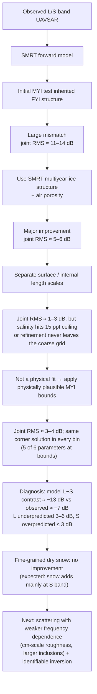
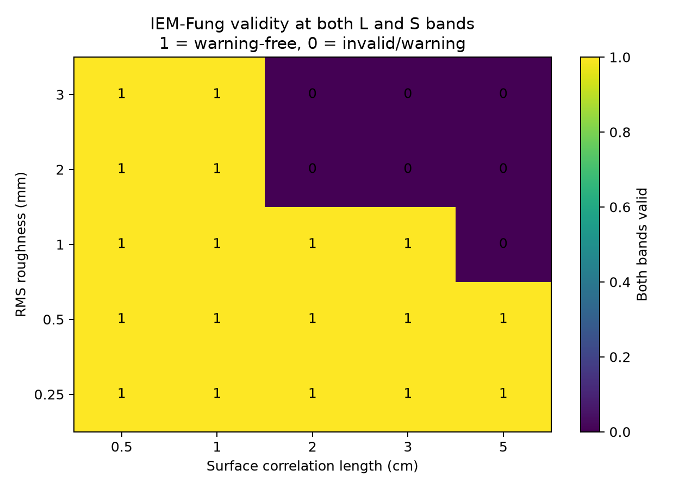
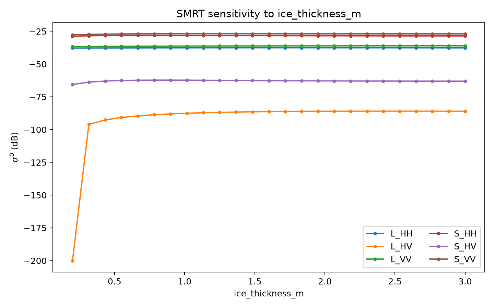
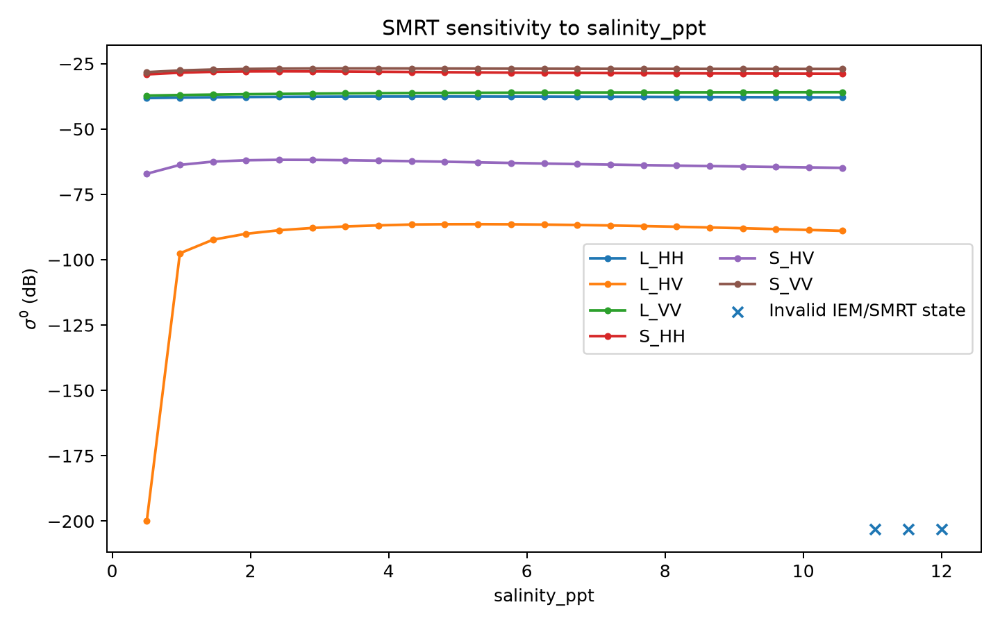
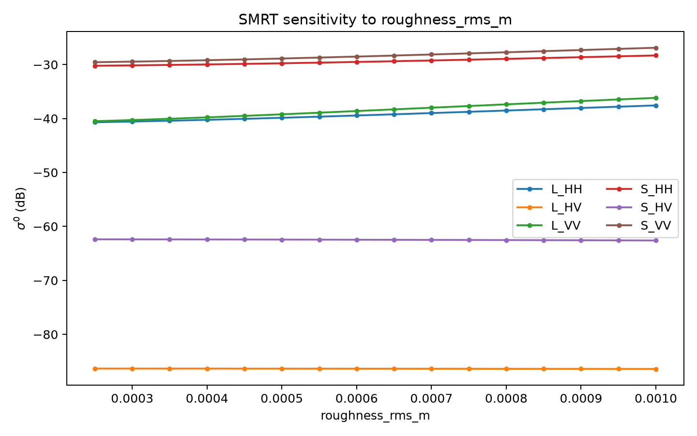
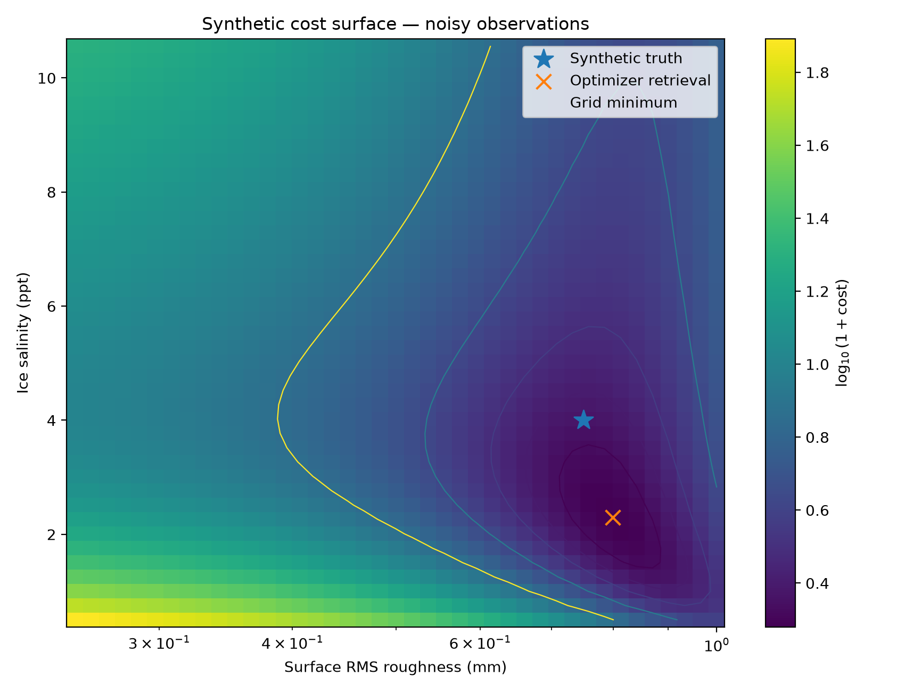

# Sea-ice radiative-transfer identifiability with L/S-band SAR

**Preliminary SMRT study of forward-model adequacy, parameter identifiability, and the feasibility of a later physics-constrained inverse model for sea ice.**

> **Status:** pilot / feasibility study. This repository does **not** claim a validated physical retrieval or a completed real-data PINN.

### Relationship to MSc research

The L- and S-band UAVSAR observations used in the real-data experiments are
derived from the dataset analyzed in my MSc thesis at McGill University:

> *Dual-Frequency Polarimetric SAR Analysis and Physics-Constrained Neural Networks
> for Arctic Sea Ice Classification: A NISAR Baseline Study.*

The underlying dual-frequency polarimetric analysis is also the subject of the
first-author manuscript:

> Mahboob, M., Mahmud, M., Nandan, V., Howell, S.E.L., Brady, M., Cabaj, A.,
> and Dewan, A. “Discrimination of Arctic Sea Ice Types From L- and S-Band
> Fully Polarimetric UAVSAR: A NISAR Baseline Study.”
> *IEEE Journal of Selected Topics in Applied Earth Observations and Remote Sensing*.
> **Under review**, 2026. Manuscript ID: JSTARS-2026-04639.

The radiative-transfer, forward-model adequacy, identifiability, and constrained-inversion experiments documented in this repository are subsequent exploratory analyses building on those observations.

---

## At a glance


```mermaid
flowchart TD
    A["Observed L/S-band UAVSAR"] --> B["SMRT forward model"]

    B --> C["Initial MYI test inherited FYI structure"]
    C --> D["Large mismatch<br/>joint RMS ≈ 11–14 dB"]

    D --> E["Use SMRT multiyear-ice structure<br/>+ air porosity"]
    E --> F["Major improvement<br/>joint RMS ≈ 5–6 dB"]

    F --> G["Separate surface / internal length scales"]
    G --> H["Joint RMS ≈ 1–3 dB, but salinity hits 15 ppt ceiling<br/>or refinement never leaves the coarse grid"]
    H --> I["Not a physical fit → apply physically plausible MYI bounds"]
    I --> J["Joint RMS ≈ 3–4 dB; same corner solution in every bin<br/>(5 of 6 parameters at bounds)"]
    J --> K["Diagnosis: model L−S contrast ≈ −13 dB vs observed ≈ −7 dB<br/>L underpredicted 3–6 dB, S overpredicted ≤ 3 dB"]
    K --> L["Fine-grained dry snow: no improvement<br/>(expected: snow adds mainly at S band)"]
    L --> M["Next: scattering with weaker frequency dependence<br/>(cm-scale roughness, larger inclusions) + identifiable inversion"]
```

### Main numerical progression

| Stage | What changed? | Joint L+S RMS | Interpretation |
|---|---|---:|---|
| Incidence-aware MYI, FYI structure | Baseline | ≈ 11–14 dB | Wrong structural model |
| MYI structure + porosity | Structure | ≈ 5–6 dB | Structure matters most |
| Separate surface / internal length scales | More freedom | ≈ 1–3 dB | **Not physical**: salinity at 15 ppt ceiling or unrefined grid point |
| Physically plausible MYI bounds | Constrained | ≈ 3–4 dB | **Corner solution**: 5/6 parameters at bounds, identical in all bins |
| One-layer fresh/dry snow | Added layer | 0.23–0.30 dB worse | Expected; snow adds scattering mainly at S band |

The central result is therefore not simply *“SMRT fits”* or *“SMRT fails”*. Forward-model structure and parameter constraints strongly control reachability, an excellent SAR fit can be physically implausible, and under physically plausible MYI bounds the model's **L−S frequency dependence is too steep by about 6 dB**.

---

## Why this project starts with the forward problem

The eventual goal is an inverse problem:

```math
\text{SAR observations } y \;\longrightarrow\; \text{estimated physical state } \hat{m}.
```

A future physics-constrained neural network could learn an inverse map

```math
f_\theta(y) \rightarrow \hat{m},
```

while the radiative-transfer model checks whether

```math
G(\hat{m}) \approx y.
```

But that inverse model is only meaningful if the forward model itself can represent the observations over a physically defensible parameter domain.

This project therefore asks, in order:

1. **Reachability / existence:** can any allowed physical state reproduce the observed SAR?
2. **Identifiability:** can different physical states produce distinguishable SAR signatures?
3. **Stability:** do weak parameter directions amplify measurement noise?
4. **Model structure:** how strongly do FYI/MYI structure, roughness, microstructure and snow assumptions affect the answer?

Only after these questions are understood should a final real-data inverse model be trusted.

---

## Forward-model configuration

The baseline experiments use:

- [SMRT](https://www.smrt-model.science/) for microwave radiative transfer;
- IBA electromagnetic model;
- DORT radiative-transfer solver;
- IEM-Fung-1992 rough-interface scattering;
- active L band at approximately **1.257 GHz**;
- active S band at approximately **3.200 GHz**;
- HH/HV/VV in the early sensitivity experiments;
- L-HH, L-VV, S-HH and S-VV for the real-data reachability sequence.

`config/base.yaml` intentionally preserves the original **first-year-ice baseline** used in experiments 00–09. Experiments 10–13 explicitly override this with SMRT's multiyear-ice structure when testing MYI observations.

---

# Experiment sequence

## 1. Check the forward model

`00_check_smrt.py` and `01_single_forward.py`

The first step was simply to verify that a reproducible active L/S-band sea-ice forward simulation could be generated:

```math
m \;\rightarrow\; G(m) \;\rightarrow\; \sigma^0.
```

This establishes the forward-model machinery before any inversion is attempted.

---

## 2. Check IEM validity

`01b_iem_validity_grid.py`

IEM is not valid for every roughness / correlation-length combination, so the admissible model domain was mapped before optimization.



This avoids interpreting an optimizer solution that lies in a region where the rough-surface model itself is not trustworthy.

---

## 3. Parameter sensitivity

`02_parameter_sweeps.py`

Ice thickness, salinity and RMS roughness were varied separately to see how the simulated radar response changes.

<p align="center">
  
  
  
</p>

These experiments establish that different physical parameters do not influence the SAR observations equally.

---

## 4. Jacobian and SVD identifiability

`03_jacobian_svd.py`

Around a reference state,

```math
\Delta y \approx J\,\Delta m,
```

where the Jacobian contains local sensitivities

```math
J_{ij} = \frac{\partial y_i}{\partial m_j}.
```

The singular-value decomposition

```math
J = U S V^{T}
```

is then used to diagnose parameter combinations that are strongly visible or weakly visible to SAR.

For the initial two-parameter roughness-salinity diagnostic using all six L/S polarimetric channels, the whitened Jacobian had singular values of approximately **9.25** and **2.73**, with condition number **3.39**.

This is deliberately treated as a **local two-parameter diagnostic**, not proof that the complete sea-ice state is identifiable.

---

## 5. Sensor ablation

`04_sensor_ablation.py`

L-only, S-only and combined L+S information were compared.

In this specific two-parameter baseline, local conditioning was poorer for L-only (**15.80**) than for S-only (**2.08**).

The broader lesson is that dual-frequency observations can add complementary information, but simply adding channels does not guarantee unique recovery of all physical variables.

---

## 6. Synthetic inversion sanity check

`05_synthetic_inversion.py` and `05b_synthetic_cost_surface.py`

A known physical state was passed through the same SMRT forward model to generate synthetic observations. The inverse algorithm then attempted to recover the state.

With 1 dB channel noise, a synthetic truth of:

- roughness = **0.75 mm**
- salinity = **4.0 ppt**

produced a best retrieval of approximately:

- roughness = **0.799 mm**
- salinity = **2.29 ppt**

The observation reconstruction remained good even though the retrieved salinity moved substantially.



This is an important warning:

> [!IMPORTANT]
> **Good SAR reconstruction ≠ guaranteed true physical parameters.**

The synthetic test also shows that the inversion machinery itself can work when the observations genuinely come from the assumed forward model.

---

## 7. Initial real-UAVSAR reachability

`06_forward_model_existence_test.py`, `06b_expanded_bounds_existence_test.py`, and `06c_channel_subset_reachability.py`

The analysis then moved from synthetic experiments to derived L- and S-band
UAVSAR observations originating from the MSc thesis dataset described above.

The next question was:

```math
\min_{m} \; \lVert G(m) - y_{\mathrm{UAVSAR}} \rVert.
```

The initial bare-ice model could not reproduce much of the observed real-data space well. Expanding parameter bounds improved the result but did not remove the discrepancy.

Channel-subset tests also showed frequency-dependent behavior, suggesting that the mismatch was not simply a single global scale error.

The committed 06/06b outputs are retained as **historical pre-mean-audit diagnostics** and should not be quantitatively compared with the later incidence-aware experiments.

---

## 8. Observation and incidence-angle audit

`07_prepare_no_incidence_normalization.py`, `08_prepare_incidence_binned_observations.py`, `09_incidence_aware_reachability.py`, and `09b_incidence_aware_safe_refinement.py`

Before adding more model physics, the SAR comparison itself was audited.

The real-data preparation was rebuilt to:

- average radar power in the **linear-power domain** before converting back to dB;
- remove the empirical normalization to 35°;
- bin observations by actual incidence angle;
- run SMRT at each bin's measured mean incidence angle.

The large MYI mismatch still remained under the FYI structural model.

Each bin pools pixels from a small number of ROIs; the number of ROIs per bin is not yet reported.

A safe derivative-free refinement was also used to avoid invalid IEM trial states. It produced essentially no improvement over the coarse-grid optimum, confirming that the remaining discrepancy was not simply an optimizer failure.

---

# Key physical findings

## 9. Correcting FYI → MYI structure was decisive

`10_myi_multiyear_reachability.py`

The earlier MYI comparisons had inherited:

```yaml
ice_type: firstyear
```

from the baseline configuration.

Experiment 10 instead used SMRT's multiyear-ice representation and introduced air porosity.

The joint L+S RMS changed as follows:

| Incidence bin | FYI structure | MYI structure | Improvement |
|---|---:|---:|---:|
| 30–33° | 11.56 dB | 5.01 dB | 6.55 dB |
| 45–48° | 12.87 dB | 5.07 dB | 7.79 dB |
| 48–51° | 14.25 dB | 6.22 dB | 8.02 dB |
| 51–54° | 13.65 dB | 5.53 dB | 8.12 dB |

**Interpretation:** the physical structure of the forward model mattered much more than simple parameter tuning.

---

## 10. Separating surface and internal MYI length scales lowered the misfit, but not with a physical state

`11_myi_length_scale_reachability.py`

Two physically different scales were allowed to vary independently:

- surface correlation length for rough-interface scattering;
- internal MYI microstructure / bubble correlation length.

The joint L+S RMS fell to approximately **1.05–2.97 dB** across the four MYI incidence bins.

However, these fits are not physical retrievals. In the 30–33° and 45–48° bins the
optimizer drove salinity to its 15 ppt upper bound (implausible for MYI) and porosity
to its 0.30 upper bound. In the 48–51° and 51–54° bins the refinement did not move
from the coarse-grid starting point (salinity 0.5 ppt and thickness 6.0 m are the fixed
coarse-grid values, which are also bounds). This experiment therefore shows that the model
*can* reach the observations with enough freedom, not that it does so with a
realistic state.

---

## 11. Physically tighter MYI bounds exposed parameter compensation

`12_myi_semi_constrained_reachability.py`

Internal MYI properties were restricted to tighter ranges:

- salinity: **1–4 ppt**
- thickness: **1–3 m**
- internal correlation length: **0.2–0.8 mm**

The joint RMS increased to approximately **3.24–4.03 dB**.

At the joint solutions:

- S-band RMS remained approximately **0.76–2.66 dB**
- L-band RMS remained approximately **4.27–5.65 dB**

In every incidence bin the joint L+S optimum is the **same state**: roughness 3 mm,
porosity 0.30 and internal correlation length 0.8 mm at their upper bounds,
salinity 1 ppt at its lower bound, thickness 3 m at its upper bound (only the surface
correlation length, 15 mm, is interior). The local refinement did not improve on this
coarse-grid point (`coarse-grid fallback`, 0 function evaluations, in all four bins).
The reported 3.2–4.0 dB is therefore the model's closest approach from the
high-scattering corner of the allowed domain, not an interior optimum.

Residuals (model − observed, dB) and L−S contrast at the joint solution:

| Bin | L-HH | L-VV | S-HH | S-VV | Obs L−S (HH) | Model L−S (HH) |
|---|---:|---:|---:|---:|---:|---:|
| 30–33° | −3.4 | −5.7 | +3.0 | +2.3 | −6.9 | −13.3 |
| 45–48° | −3.9 | −4.6 | +1.8 | +1.5 | −7.2 | −13.0 |
| 48–51° | −5.3 | −5.9 | +0.2 | +1.0 | −7.3 | −12.9 |
| 51–54° | −4.1 | −5.2 | +0.6 | +1.3 | −8.1 | −12.8 |

The problem is the **frequency dependence**, not a uniform L-band deficit.
With mm-scale roughness, surface scattering at L band is weak (ks ≈ 0.08 for
s = 3 mm), so the model has little L-band mechanism other than small-inclusion
volume scattering, which falls off steeply with wavelength. The observations require
a mechanism whose response falls off much less from S to L.

> **A very good unconstrained SAR fit does not automatically imply that the retrieved physical state is identifiable or realistic.**

---

## 12. A simple fresh/dry snow layer did not solve the remaining discrepancy

`13_myi_one_layer_snow_test.py`

The experiment-12 ice/interface state was frozen, and only one simple snow layer was varied in:

- depth;
- density;
- snow correlation length.

The best tested snow state worsened joint L+S RMS by approximately **0.23–0.30 dB** in every retained MYI incidence bin.

No tested state improved L-band RMS by at least 0.5 dB while keeping the S-band penalty within the specified tolerance.

This does **not** imply that snow is unimportant. It only shows that this simple homogeneous fresh/dry representation is insufficient to explain the remaining mismatch.

This outcome is consistent with expectation: fine-grained dry snow is a small-grain
(Rayleigh-like) scatterer that is nearly transparent at L band, so any scattering it
adds falls mainly at S band and cannot correct an L−S contrast that is already too
steep. Note also that the snow was added to a fixed ice state lying at the parameter
bounds; a joint re-optimization was not performed.

---

# Current interpretation

The pilot now supports the following research question:

> **How can multi-frequency SAR be inverted with a radiative-transfer model while maintaining physical plausibility, identifiability and uncertainty awareness, rather than obtaining good fits through parameter compensation?**

## Proposed next experiments

1. **Relax the roughness bound.** The 3 mm cap is a chosen bound, not the IEM validity
   limit enforced in this code (ks < 3 and ks·kl < √εr, `src/forward_smrt.py`). At S band
   that limit permits rms heights of roughly 1–3 cm for surface correlation lengths of
   15–20 mm, and MYI hummock roughness is centimetre-scale or larger. Test whether the
   L-band deficit and the L−S contrast close within IEM validity; if the solution
   approaches the validity limit, compare against SMRT's extended-domain IEM
   (`iem_fung92_brogioni10`) or its geometrical-optics interface (`geometrical_optics`),
   both shipped with SMRT 1.7.
2. **Larger / non-Rayleigh inclusions** in the MYI upper layer (bubble-size
   distributions rather than a single exponential correlation length).
3. **ROI-level fitting.** Fit each ROI at its own mean incidence angle, so bin-to-bin
   consistency is not confounded with ROI identity.
4. **Identifiability and uncertainty** of whatever state closes the gap (Jacobian/SVD
   at the fitted state, posterior sampling), before any learned inverse model.
5. Only then: a physics-constrained inverse model (PINN/KAN) for NISAR L/S.

These are **future research directions**, not completed results in this repository.

---

## Repository structure

```text
config/        baseline model and sensor configuration
src/           reusable SMRT forward, inversion and sensitivity utilities
experiments/   numbered scientific diagnostics
results/       selected summary tables and figures
data/          templates and documentation
```

The experiments are chronological diagnostics rather than one production pipeline.

Suggested reading order:

```text
00 → 01 → 01b → 02 → 03 → 04 → 04b → 05 → 05b
   → 06 → 06b → 06c
   → 07 → 08 → 09 → 09b
   → 10 → 11 → 12 → 13
```

---

## Data and provenance

The real-data experiments use **derived L- and S-band SAR observations originating
from the UAVSAR dataset analyzed in my MSc thesis at McGill University**,
*Dual-Frequency Polarimetric SAR Analysis and Physics-Constrained Neural Networks
for Arctic Sea Ice Classification: A NISAR Baseline Study*.

The underlying dual-frequency polarimetric analysis is also described in the
associated first-author manuscript,
*“Discrimination of Arctic Sea Ice Types From L- and S-Band Fully Polarimetric
UAVSAR: A NISAR Baseline Study,”* currently under review at
*IEEE Journal of Selected Topics in Applied Earth Observations and Remote Sensing*
(JSTARS-2026-04639).

This public repository does **not** redistribute:

- raw UAVSAR products;
- processed SAR rasters;
- ROI shapefiles;
- per-pixel MSc thesis datasets.

Only selected derived observation summaries, plots, and processing/model scripts
needed to document the exploratory radiative-transfer analysis are included.

The SMRT forward-modelling, reachability, sensitivity, identifiability, and
constrained-inversion experiments presented here are subsequent exploratory analyses
and should not be interpreted as results of the associated submitted manuscript unless explicitly stated.

Before reuse or redistribution of the underlying SAR-derived observations or results,
appropriate data ownership, collaboration, and publication considerations should be respected.

Set the external data root before running the real-observation preparation scripts:

```bash
export RTE_PINN_ASAR_ROOT=/path/to/ASAR
```

The expected layout is documented in `data/README.md`.

---

## Installation

Install the Python dependencies:

```bash
python -m pip install -r requirements.txt
```

SMRT was developed/tested here from a local checkout. Follow the current SMRT installation instructions for your environment and verify the installation with:

```bash
python experiments/00_check_smrt.py
```

---

## Limitations and claim discipline

This repository does **not** establish:

- validated retrieval of true sea-ice salinity, thickness, roughness or porosity;
- uniqueness of the full physical inverse problem;
- a completed real-data PINN/KAN inversion;
- validation of the snow representation against coincident field observations;
- that the remaining L-band discrepancy is caused by any single missing physical process;
- that the experiment-11 and experiment-12 optima are interior optima (they lie at or
  near parameter bounds or on the coarse grid);
- independence of the incidence bins: each bin pools pixels from a small number of
  ROIs, so bins are not independent replicates of an angular effect.

The defensible conclusion is narrower:

> **The experiments diagnose forward-model adequacy, sensitivity, reachability and parameter compensation, and identify where additional physical constraints and measurements are required before a final inverse model is justified.**

---

## Reference

Picard, G., Sandells, M., & Löwe, H. (2018).  
*SMRT: An active-passive microwave radiative transfer model for snow with multiple microstructure and scattering formulations.*  
**Geoscientific Model Development, 11**, 2763–2788.  
https://doi.org/10.5194/gmd-11-2763-2018
